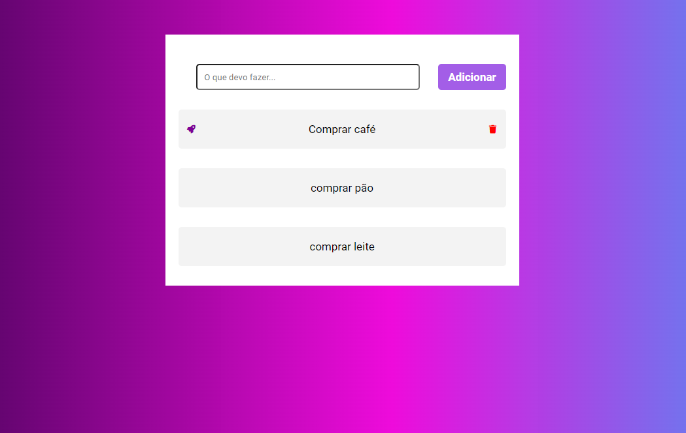

# Task-list

> Essa lista de tarefas foi um trabalho estudantil, feita na semana desafio programador 5D idealizado pelo Rodolfo Mori.

## 🤝 Colaboradores

Agradecemos às seguintes pessoas que contribuíram para este projeto:

<table> 
  <tr>
    <td align="center">
      <a href="#">
         
        
          <b>Eudes Barbosa</b>
        
      </a>
    </td>
    <td align="center">
      <a href="#">
         
        
          <b>Rodolfo Mori</b>
        
      </a>
    </td>
</tr>
</table>

[⬆ Voltar ao topo](#Task-list) 